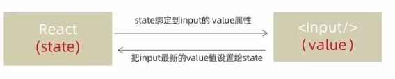
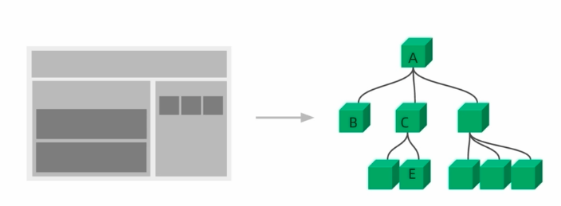
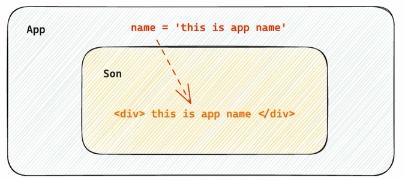
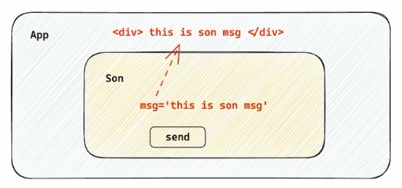
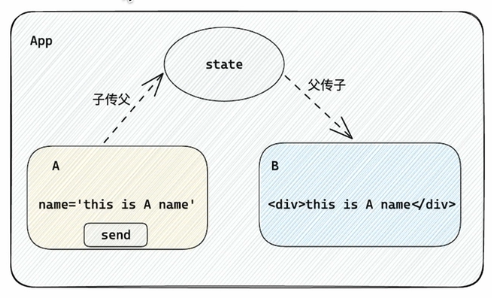
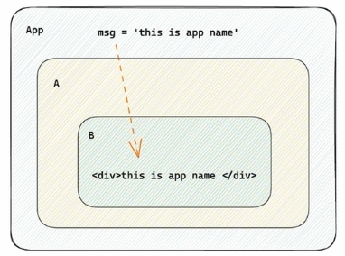
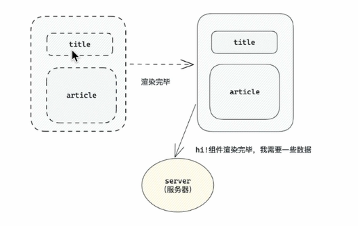
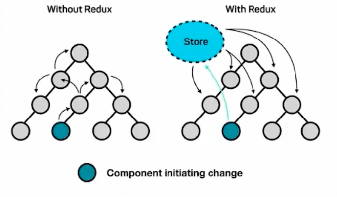
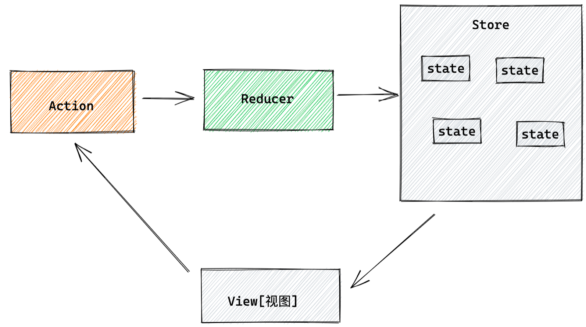
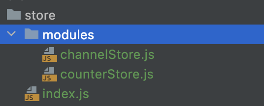

# Study React

## React 是什么 

React由Meta(Facebook)公司研发， 是一个用于 `构建WEB和原生交互界面的库`。

可以在浏览器上运行，也可以打包成移动端应用。 

### 优势
* 想较于传统基于DOM开发
  - 组件化的开发方式
  - 不错的性能
* 相较于其它前端框架
  - 丰富的生态
  - 跨平台支持

## 使用 create-react-app 快速搭建开发环境

create-react-app 是一个快速 `创建React开发环境的工具`， 底层由Webpack构建，`封装了配置细节`，开箱即用。

执行命令： `npx create-react-app react-basic`
- npx: Node.js工具命令，查找并执行后续的包命令。
- create-react-app: 核心包（固定写法）， 用于创建React项目。
- react-basic React项目的名称（可自定义的）。

当然 还有更多创建方式，具体可前往： [启动一个新的 React 项目](https://zh-hans.react.dev/learn/start-a-new-react-project)

## JSX

### 什么是 JSX

JSX 是 javaScript 和 XML(HTML) 的缩写， 表示在 `JS代码中编写HTML模板结构`， 它是React编写UI模板的方式。

为什么要使用 JSX ? 使用它有两个好处：可以使用HTML的声明式模板写法还可以拥有JS的可编程能力。

### JSX 的本质
JSX 并不是标准的 JS 语法，它是 `JS 的语法扩展`， 浏览器并不能识别， 需要通过 `解析工具做了解析` 后才能在浏览器中运行。

### 在JSX 中使用 JS 表达式

在 JSX 中 可以通过 `大括号语法{}` 识别 JavaScript中的表达式， 比如常见的变量、函数调用、方法调用等。

1. 使用引号传递字符串

2. 使用 JavaScript 变量
3. 函数调用
4. 方法调用

```js
const count = 100

function getName() {
    return 'Acyco'
}
function Jsx01() {
    return (
        <div>
            {/* 使用引号传递字符串 */}
            {'this is message'}
            {/* 使用JavaScript变量 */}
            {count}
            {/* 函数调用 */}
            {getName()}
            {/* 方法调用 */}
            {new Date().getDate()}
            {/* js对象 */}
            <div style={{color: 'red'}}> this is div</div>

        </div>
    );

}
```
> 注意： if 语句，switch 语句、 变量声明属于语句，不是表达式， 不能出现在{}中

### JSX 中实现列表渲染

语法： 在 JSX 中可以使用原生 JS 的 `map方法` 遍历渲染列表。

```js
const list = [
    { id: 1001, name: 'Vue'},
    { id: 1002, name: 'React'},
    { id: 1003, name: 'Angular'}
]

function Jsx02() {
    return (
        <div>
            {/*  渲染列表  */}
            <ul>
                {list.map(item=><li key={item.id}>{item.name}</li>)}
            </ul>
        </div>
    )
}
```
说明：
* map 循环哪个结构，return 哪个结构。
* 注意事项： 加上一个独一无二的 key, 字符串或 number id。
* key 的作用： React 框架内部使用的，用来提升更新性能的。

### JSX 实现条件渲染

语法： 在 React 中，可以通过 `逻辑与运算符&&、三元表达式(?:)` 实现基础的条件渲染。

```js
const isLogin = true

export default function JSX03 () {
    return (
        <div>
            {/* 逻辑与 && */}
            <div>
                {isLogin && <span> this is span</span>}
            </div>
            {/* 三元运算符 */}
            <div>
                {isLogin ? <span>Acyco</span> : <span>Loading....</span> }
            </div>

        </div>
    )
}
```

### JSX 中实现复杂条件渲染

```js
const articleType = 3 // 0 1 3

// 定义核心函数 （根据文章类型返回不同的JSX模板
function getArticleTemp() {
    if (articleType === 0) {
        return <div>无图文章</div>
    } else if (articleType === 1) {
        return <div>单图文章</div>
    } else {
        return <div>三图模式</div>
    }
}

export default function Jsx04 (){
    return (
        <div>
            {/* 调用函数渲染不同的模板*/}
            {getArticleTemp()}
        </div>
    )
}
```

## React 中的事件绑定

### React 基础事件绑定

语法： `on + 事件名称 = { 事件处理程序 }`，整体上遵循驼峰命名法。

```js
function App() {
  const handleClick = () => {
    console.log("button被点击了");
  }
  return (
    <div className="App">
      <button onClick={handleClick}>click me</button>
    </div>
  );
}
```

### 使用事件对象参数
语法： 在事件回调函数中 `设置形参 e`

```js
function App() {
  // 事件参数e
  const handleClick = (e) => {
    console.log("button被点击了",e);
  }
  return (
    <div className="App">
      <button onClick={handleClick}>click me</button>
    </div>
  );
}
```

### 传递自定义参数
语法： 事件绑定的位置改造成 `箭头函数的写法`， 在执行实际`处理业务函数`的时候传送实参。

```js
function App() {
  // 事件参数e
  const handleClick = (name,e) => {
    console.log("button被点击了",name,e);
  }
  return (
    <div className="App">
      <button onClick={() =>handleClick('Acyco')}>click me</button>
    </div>
  );
}
```

> 注意：不能直接写函数调用，这里事件的绑定需要一个 `函数引用`。

### 同时传递事件对象和自定义参数
语法： 在事件绑定的位置传递事件实参 e 和自定义参数， 处理函数中声明形参，注意顺序要一一对应。

```js
function App() {
  // 事件参数e
  const handleClick = (name,e) => {
    console.log("button被点击了",name,e);
  }
  return (
    <div className="App">
      <button onClick={(e) =>handleClick('Acyco',e)}>click me</button>
    </div>
  );
}
```

## React组件基础使用

### 组件是什么

概念： 一个组件就是用户界面的一部分， 它可以有自己的逻辑和外观。 组件之间 `可以互相嵌套，也可以复用多次`，组件化开发可以让开发者像搭积木一样构建一个完整的庞大的应用。

### React 组件

在 React 中，一个组件就是 `首字母大写的函数`，内部存放了组件的逻辑和视图 UI， 渲染组件只需要把组件 `当成标签书写` 即可。

```js
// 定义组件
function Button() {
  // 业务逻辑组件逻辑
  return <button>click me!</button>
}

function App() {
  return (
    <div className="App">
      {/* 自闭合标签 */}
      <Button />
      {/* 成对标签 */}
      <Button></Button>
    </div>
  );
}
```

同样也可以使用箭头函数进行定义。

```js
// 定义组件
const Button = () => {
  // 业务逻辑组件逻辑
  return <button>click me!</button>
}
```

## useState 

## useState 基础使用

useState 是一个 React Hook (函数)，它允许我们向组件添加一个状态变量，从而控制影响组件的渲染结果。

本质：和普通 JS 变量不同的是， 状态变量一旦发生变化，受控制的组件视图UI也会跟着变化（数据驱动视图）。

```js
const [count, setCount] = useState(0)
```
说明：
1. useState 是一个函数， 返回值是一个数组。
2. 数组中的第一个参数是状态变量，第二个参数是set函数是用来修改状态变量。
3. useState 的参数将作为 count 的初始值

```js
// useState实现一个计数器按钮
import {useState} from "react";
function App() {
    // 1. 调用useState添加一个状态变量
    // count 状态变量
    // setCount 修改状态变量的方法
    const [count, setCount] = useState(0)

    // 2. 点击事件回调
    const handleClick = () => {
        // 作用： 1. 用传入的新值修改count, 2. 重新使用新的count渲染UI
        setCount(count + 1)
    }
  return (
    <div className="App">
        <button onClick={handleClick}>{count}</button>
    </div>
  );
}
```

### useState 修改状态的规则

#### 状态不可变

在 React 中，状态被认为是只读的，我们应该始终 `替换它而不是修改它`， 直接修改状态不能引发视图更新。

```js
import {useState} from "react";
function App() {

  let  [count, setCount] = useState(0)

  const handleClick = () => {
    // 直接修改是无法引发视图更新
    // count++
    // console.log(count);
    setCount(count + 1);
  }
  return (
          <div className="App">
            <button onClick={handleClick}>{count}</button>
          </div>
  );
}
```
#### 修改对象状态

规则： 对于对象类型的状态变量， 应该始终传给set方法一个 `全新的对象` 来进行修改。

```js
import {useState} from "react";
function App() {
    const [form, setForm] = useState({name: "Acyco"})
    const changeForm = () => {
        // 错误写法: 直接修改
        // form.name = "Alice"
        // 正确写法： setForm 传入一个全新的对象
        setForm({
            ...form,
            name: "Alice"
        })
    }
  return (
    <div className="App">
        <button onClick={changeForm}>修改form：{form.name}</button>
    </div>
  );
}
```

## 组件样式处理
 
### 组件基础样式方案

1. 行内样式（不推荐）
```js
function App() {
    const style = {
        color: 'red',
        fontSize: '50px'
    }

  return (
    <div className="App">
       {/* 行内样式控制 */}
      <span style={{color: 'red', fontSize: '50px'}}> this is span</span>
      <span style={style}> this is span</span>
    </div>
  );
}
```
2. class 类名控制

`index.css`
```css
.foo {
    color: blue;
}
```

```js
import './index.css'

function App() {
  return (
    <div className="App">
        {/* 通过class类名控制 */}
        <span className="foo"> this is class foo</span>
    </div>
  );
}
```

## 受控表单绑定

概念： 使用 React 组件的状态 (useState) 控制表单状态。



1. 准备一个 React 状态值

```js
 const [value, setValue] = useState('')
```

2. 通过 value 属性绑定状态，通过 onChange 属性绑定状态同步的函数。

```js
<input
  type="text"
  value={value}
  onChange={(e) => setValue(e.target.value)}
/>
```

```js
// 1. 声明一个react状态 - useState
// 2. 核心绑定流程
//  1）通过value属性绑定react状态
//  2）绑定onChange事件，通过事件参数e拿到输入框最新的值，反向修改到react状态
import {useState} from "react";

function App() {
  const [value, setValue] = useState('')

    return (
       <div>
         <input
           type="text"
           value={value}
           onChange={(e) => setValue(e.target.value)}
         />
        </div>
    );
}
```
## React 中获取 DOM

在 React 组件中获取/操作 DOM，需要使用 `useRef` 钩子函数， 分为两步：

1. 使用 useRef 创建 ref 对象， 并与 JSX 绑定
2. 在 DOM 可用时，通过 inputRef.`current` 拿到 DOM 对象

```js
// 1. useRef生成ref对象，绑定到dom标签上
// 2. dom可用时，ref.current获取dom
// 渲染完毕之后dom生成之后才可用。

import {useRef} from "react";

function App() {

  const inputRef = useRef(null)
  const showDom = () => {
    console.dir(inputRef.current)
  }

    return (
       <div>
         <input
           type="text" ref={inputRef} />
         <button onClick={showDom}>获取dom</button>
        </div>
    );
}
```

## 组件通信

### 理解组件通信
概念： 组件通信就是 `组件之间的数据传递`， 根据组件嵌套关系的不同， 有不同的通信方法。



### 父传子 - 基础实现



1. 父组件传递数据 - 在子组件标签上 `绑定属性`，
2. 子组件接收数据 - 子组件通过 `props 参数` 接收数据。

```js
function Son(props) {
  // props:对象里面包含了父组件传递过来的所有数据
  console.log(props)
  return <div>this is son, {props.name}</div>
}

function App() {
  const name = 'this is app name'
    return (
       <div>
         <Son name={name}/>
        </div>
    );
}
```

### 父传子 - props 说明
1. props 可传递任意数据， 数字、字符串、布尔值、数组、对象、函数、JSX。
2. props 是只读对象，子组件 `只能读取 props 中的数据`, 不能直接进行修改， 父组件的数据只能由父组件修改，
3. 

```js
function Son(props) {
  // props:对象里面包含了父组件传递过来的所有数据
  // {name:'父组件中的数据'}
  console.log(props)
  //props.name= 'new name' // TypeError: Cannot assign to read only property 'name' of object '#<Object>'
  return <div>this is son, {props.name}, jsx: {props.child} </div>
}

function App() {
  const name = 'this is app name'
  return (
    <div>
      <Son
        name={name}
        age={18}
        isTrue={false}
        list={['vue', 'react']}
        obj={{name: 'Acyco'}}
        cb={()=> console.log(123)}
        child={<span>this is span</span>}
      />

    </div>
  );
}
```

### 父传子-特殊的 prop children

场景： 当我们把内容嵌套在子组件标签中时，父组件会自动在名为 children 的 prop 属性中接收该内容。

```js
function Son(props) {
  console.log(props);
  return <div>this is son, {props.children}</div>
}

function App() {
  const name = 'this is app name'
    return (
       <div>
         <Son>
           <span>this is span</span>
         </Son>

        </div>
    );
}
```
### 子传父



核心思路： 在子组件中调用父组件中的函数并传递参数。

```js
import {useState} from "react";

function Son({onGetSonMsg}) {
  const sonMsg = 'this is son msg'
  return <div>
    this is Son
    <button onClick={()=> onGetSonMsg(sonMsg)}>sendMsg</button>
  </div>
}

function App() {
  const [msg,setMsg] = useState('')
  const getMsg = (msg) => {
    console.log(msg)
    setMsg(msg)
  }
    return (
       <div>
         this is App, {msg}
         <Son onGetSonMsg={getMsg} />
       </div>
    );
}
```

### 使用状态提升实现兄弟组件通信



实现思路： 借助"状态提升"机制， 通过父组件进行兄弟组件之间的数据传递。

```js

import {useState} from "react";

function A({onGetAName}) {
  const name = 'this is A name'
  return (
    <div>
      this is A component,
      <button onClick={() => onGetAName(name)}>send</button>
    </div>
  )
}

function B({name}) {
  return (
    <div>
      this is B component,
      {name}
    </div>
  )
}

function App() {
  const [name, setName] = useState('')
  const getAName = (name) => {
    console.log(name)
    setName(name)
  }
  return (
    <div>
      this is App,
      <A onGetAName={getAName}/>
      <B name={name}/>
    </div>
  );
}
```

1. A组件先通过子传父的方式把数据传给父组件App。
2. App拿到数据后通过父传子的方式再传递给B组件。

### 使用 Context 机制跨层级组件通信



实现步骤：

1. 使用 createContext 方法创建一个上下文对象 Ctx 。
2. 在顶层组件（APP）中通过 `Ctx.Provider 组件` 提供数据。
3. 在底层组件中通过 useContext 钩子函数获取消费数据。
 
```js
import {createContext, useContext} from "react";

const MsgContext = createContext()
function A() {
  return (
    <div>
      this is A component
      <B />
    </div>
  )
}

function B() {
 const msg = useContext(MsgContext)
  return (
    <div>
      this is B component,{msg}
    </div>
  )
}

function App() {
const msg = 'this is app msg'

  return (
    <div>
      <MsgContext.Provider value={msg}>
        this is App,
        <A />
      </MsgContext.Provider>
    </div>
  );
}
```

## useEffect 的使用

### useEffect 的概念理解

useEffect 是一个 React Hook 函数， 用于在 React 组件中创建不是由事件引起而是 `由渲染本身引起的操作`，比如发送 Ajax请求， 更改 DOM等等。



说明： 上面的组件中没有发生任何的用户事件，`组件渲染完毕之后` 就需要和服务器要数据， 整个过程属于 "`只由渲染引起的操作`"。

### useEffect 的基础使用

需求： 在组件渲染完毕之后， 立刻从服务端获取频道列表数据并显示到页面中

语法： `useEffect(() => { },[])`

参数1是一个函数，可以把它叫作副作用函数，在函数内部可以放置要执行的操作。
参数2是一个数组（可选参数），在数组里放置依赖项， 不同依赖项会影响第一个参数函数的执行， `当是一个空数组的时候，副作用函数只会在组件渲染完毕之后执行一次`。

```js
import {useEffect, useState} from "react";

const URL= 'https://2023.ipchaxun.com'
function App() {
  const[ip,setIp] = useState([])
  useEffect(() => {
    // 额外的操作，获取频道列表
    async function getIP() {
      const res = await fetch(URL)
      const jsonRes = await res.json()
      console.log(jsonRes)
      setIp(jsonRes.data)
    }
    getIP()
  }, [])
  return (
    <div>
        this is App
      <ul>
        {ip.map(item => <li key={Math.random()}>{item}</li>)}
      </ul>
    </div>
  );
}
```

### useEffect 依赖项参数说明

useEffect副作用函数的执行时机存在多种情况，根据 `传入依赖项的不同`， 会有不同的执行表现。

|   依赖项   |     副作用执行时间      |
|:-------:|:----------------:|
|  没有依赖项  |  组件初始渲染+组件更新时执行  |
| 空数组依赖项  |   只在初始渲染时执行一次    |
| 添加特定依赖项 | 组件初始渲染+特性依赖变化时执行 |

* 没有依赖项
```js
import {useEffect, useState} from "react";

function App() {
  const [count,setCount] = useState(0)
  useEffect(() => {
    console.log("副作用函数执行了");
  })
  return (
    <div>
      this is app
      <button onClick={()=>setCount(count + 1)}>+{count}</button>
    </div>
  )
}
```
* 空数组依赖项

```js
import {useEffect, useState} from "react";

function App() {
  const [count,setCount] = useState(0)
  useEffect(() => {
    console.log("副作用函数执行了");
  },[])
  return (
    <div>
      this is app
      <button onClick={()=>setCount(count + 1)}>+{count}</button>
    </div>
  )
}
```
* 添加特定依赖项

```js
import {useEffect, useState} from "react";

function App() {
  const [count,setCount] = useState(0)
  useEffect(() => {
    console.log("副作用函数执行了");
  },[count])
  return (
    <div>
      this is app
      <button onClick={()=>setCount(count + 1)}>+{count}</button>
    </div>
  )
}
```

### useEffect 清除副作用

在 useEffect 中编写的 `由渲染本身引起的对接组件外部的操作`，社区也经常把它叫作 `副作用操作`，比如在 useEffect 中开启了一个定时器，想在组件制裁时把这个定时器再清理掉，这个过程就是清理副作用。

```js
import {useEffect, useState} from "react";

function Son () {
  // 1. 渲染时开启一个定时器
  useEffect(() => {
    const timer = setInterval( ()=> {
      console.log("定时器执行中...")
    }, 1000)

    return () => {
      // 清除副作用 （组件卸载时）
      clearInterval(timer)
    }
  })
  return (
    <div>this is son</div>
  )
}

function App() {
  // 通过条件渲染模拟组件卸载
  const [show,setShow] = useState(true)
  return (
    <div>
      {show && <Son />}
      <button onClick={()=>setShow(false)}>卸载Son组件</button>
    </div>
  )
}
```


## 自定义 Hook 实现

### 自定义 Hook 函数

概念：自定义 Hook 是以 `use 开头的函数`，通过自定义 Hook函数可以用来实现 `逻辑的封装和复用`。

* 不封闭
```js
import { useState} from "react";
function App() {
  const [value,setValue] = useState(true)
  const toggle = () => setValue(!value)
  return (
    <div>
      {value && <div>this is div</div>}
      <button onClick={toggle}>toggle</button>
    </div>
  )
}
```
* 封装自定义 

```js
// 问题： 布尔切换的逻辑 当前组件耦合在一起的 不方便复用
// 解决思路： 自定义hook

import {useEffect, useState} from "react";

function useToggle () {
  const [value, setalue] = useState(true)
  const toggle = () => setValue(!value)
  // 哪些状态和回调函数需要在其他组件使用 return
  return {
    value,
    toggle
  }
}
// 封装自定义 hook 通用思路
// 1. 声明一个以 use 打头的函数
// 2. 在函数体内封装可利用的逻辑（只要是可用的逻辑）
// 3. 把组件中用到的状态或回调return出去 (以对象或数组）
// 4. 在哪个组件中要用到这个逻辑， 就执行这个函数， 解构出来状态和回调进行使用

function App() {
  const [value,toggle] = useToggle();
  return (
    <div>
      {value && <div>this is div</div>}
      <button onClick={toggle}>toggle</button>
    </div>
  )
}
```

### ReactHooks 使用规则

* 使用规则 

1. 只能在组件中使用或者其他自定义 Hook 函数中调用。
2. 只能在组件的顶层调用， 不能嵌套在 if、for、其他函数中

```js

import {useState} from "react";

//  Line 7:1:  React Hook "useState" cannot be called at the top level. React Hooks must be called in a React function component or a custom React Hook function  react-hooks/rules-of-hooks
// useState(''); // 组件外使用


function App() {
  // if for 组件内部函数
  if(Math.random() >0.5){
    // Line 14:5:  React Hook "useState" is called conditionally. React Hooks must be called in the exact same order in every component render  react-hooks/rules-of-hooks
    useState(''); // 
  }
  return (
    <div>
      this is app
    </div>
  )
}

```

## Redux

### 什么是 Redux

Redux 是 React 最常用的 `集中状态管理工具`，类似于 Vue 的Pinia(Vuex), `可以独立于框架运行`

作用： 通过集中管理的方式管理应用状态

1. 独立于组件，无视组件之间的层级关系，简化通信问题
2. 单项数据流清晰，易于定位bug
3. 调试工具配套良好，方便调试



### Redux 快速体验

不和任何框架绑定，不使用任何构建工具 使用纯 React 实现计算器

使用步骤：
1. 定义一个 `reducer 函数` （根据当前想要做的修改返回一个新的状态）
2. 使用 createStore 方法传入 reducer函数 生成一个 `store实例对象`
3. 使用 store 实例的 `subscribe方法` 订阅数据的变化（数据一旦变化，可以得到通知）
4. 使用 store 实例的 `dispatch 方法提交 action 对象` 触发数据变化（告诉 reducer 你想怎么改数据）
5. 使用 store 实例的 `getState 方法` 获取最新的状态数据更新到视图中


```js
<button id="decrement">-</button>
<span id="count">0</span>
<button id="increment">+</button>

<script src="https://unpkg.com/redux@latest/dist/redux.min.js"></script>

<script>
  // 1. 定义reducer函数 
  // 作用: 根据不同的action对象，返回不同的新的state
  // state: 管理的数据初始状态
  // action: 对象 type 标记当前想要做什么样的修改
  function reducer (state = { count: 0 }, action) {
    // 数据不可变：基于原始状态生成一个新的状态
    if (action.type === 'INCREMENT') {
      return { count: state.count + 1 }
    }
    if (action.type === 'DECREMENT') {
      return { count: state.count - 1 }
    }
    return state
  }

  // 2. 使用reducer函数生成store实例
  const store = Redux.createStore(reducer)

  // 3. 通过store实例的subscribe订阅数据变化
  // 回调函数可以在每次state发生变化的时候自动执行
  store.subscribe(() => {
    console.log('state变化了', store.getState())
    document.getElementById('count').innerText = store.getState().count
  })

  // 4. 通过store实例的dispatch函数提交action更改状态 
  const inBtn = document.getElementById('increment')
  inBtn.addEventListener('click', () => {
    // 增
    store.dispatch({
      type: 'INCREMENT'
    })
  })

  const dBtn = document.getElementById('decrement')
  dBtn.addEventListener('click', () => {
    // 减
    store.dispatch({
      type: 'DECREMENT'
    })
  })

  // 5. 通过store实例的getState方法获取最新状态更新到视图中

</script>

```

### Redux 管理数据流程梳理



为了职责清晰，Redux代码被分为三个核心的概念，我们学redux，其实就是学这`三个核心`概念之间的配合，三个概念分别是:

1. state:  一个对象 存放着我们管理的数据
2. action:  一个对象 用来描述你想怎么改数据
3. reducer:  一个函数 根据 action 的描述更新 state

### Redux 与 React - 环境准备
Redux 虽然是一个框架无关可以独立运行的插件，但是社区通常还是把它与 React 绑定在一起使用，以一个计数器案例体验一下 Redux + React 的基础使用

### 1.配套工具
在 React 中使用 redux，官方要求安装俩个其他插件 - `Redux Toolkit` 和 `react-redux`

1. Redux Toolkit（RTK）- 官方推荐编写Redux逻辑的方式，是一套工具的集合集，简化书写方式

2. react-redux - 用来 `链接 Redux 和 React 组件` 的中间件


### 2. 配置基础环境

1.  使用 CRA 快速创建 React 项目
```bash
npx create-react-app react-redux 
```

2.  安装配套工具
```bash
npm i @reduxjs/toolkit  react-redux 
```

3.  启动项目
```bash
npm run start 
```

## 3. store 目录结构设计



1. 通常集中状态管理的部分都会单独创建一个单独的 `store` 目录

2. 应用通常会有很多个子store模块，所以创建一个 `modules` 目录，在内部编写业务分类的子store

3. store中的入口文件 index.js 的作用是组合modules中所有的子模块，并导出store


